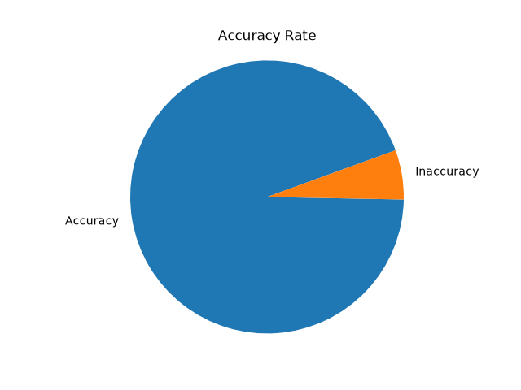

# Machine Learning Classification in Python (Scikit-learn)
 
## Overview
In this project I used python to build a machine-learning model to classify, and analyse the Breast Cancer Wisconsin Diagnostic Database within Scikit-learn. The model predicts cancer diagnoses for this dataset within 94% accuracy. 
 
## Dataset
- Source: [load_breast_cancer](https://scikit-learn.org/stable/modules/generated/sklearn.datasets.load_breast_cancer.html)
- Project Source: [How To Build a Machine Learning Classifier in Python with Scikit-learn](https://www.digitalocean.com/community/tutorials/how-to-build-a-machine-learning-classifier-in-python-with-scikit-learn)
 
## Tools & Techniques
- Languages/libraries: Python (scikit-learn)
- Methods: data cleaning, EDA, hypothesis testing, model evaluation, classification model.
 
## Process
1. Data cleaning: analyzing the data for abnormalities or formatting issues, then splitting the data into testing (33%) and training groups (67%). 
2. Classifying/modeling the data: A Gaussian Naive Bayes classifier model is trained  with the training group. Then, predictions are made with the model on the test group. 
3. Validation: Compare the test labels of cancer to the labels of cancer predicted by the classifier model. The proportion of results that were correctly predicted were 94%.
 
## Key Findings / Visualizations
- Finding: The machine learning classification model is about 94% accurate. This model is fairly accurate, but applications in this context may require more research as the consequences of false negatives would be significant, as that would imply someone who has cancer who is inaccurately classified as not having cancer.

 
## Mistakes & Fixes
At least one specific issue caught and corrected (methodology flaw, wrong assumption, bad join, etc.) and how it was identified and fixed. 

I altered the project to be different from the source project in a number of ways. 
1. I made the formatting of the code more professional and readable, organizing the structure into a main function with associated tasks being performed by the same function.
2. I added a visualization and a more user-friendly way of having the model evaluation presented. 
 
## Next Steps
My next steps for improving this project, or start a new project, would be to explore how these techniques could be used for pictures. 

# Resources Used

[Pie Charts](https://codesignal.com/learn/courses/reporting-and-visualization-for-data-analysts/lessons/creating-and-customizing-pie-charts-in-python-with-matplotlib)
  
[Data Source](https://scikit-learn.org/stable/modules/generated/sklearn.datasets.load_breast_cancer.html)  
[How To Build a Machine Learning Classifier in Python with Scikit-learn](https://www.digitalocean.com/community/tutorials/how-to-build-a-machine-learning-classifier-in-python-with-scikit-learn)  
[Machine Learning with Scikit](https://scikit-learn.org/1.4/tutorial/basic/tutorial.html)  
